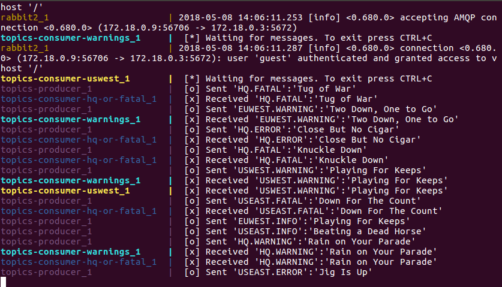

# rabbit-tutorials
> RabbitMQ tutorials implemented using the java client and docker

This project was used to learn how to use RabbitMQ, plus how the java client interacts with a RabbitMQ cluster when nodes shutdown/die.
It started with implementing each of the 5 official tutorials (https://www.rabbitmq.com/tutorials/tutorial-one-java.html) then added a 3-node cluster.

## Getting started

The minimum to see RabbitMQ in action:

```shell
docker-compose -f docker-compose-tutorial-5-with-cluster.yml up
```
Should eventually look like:


RabbitMQ management available at https://localhost:15672 (login: guest password: guest)

## Developing

Here's a brief intro about what a developer must do in order to start developing
the project further:

```shell
git clone https://github.com/permalost/rabbit-tutorials.git
cd rabbit-tutorials/
docker-compose up
```

When finished stop everything with ```ctrl-c``` then, after everything has stopped
```shell
docker-compose down
```
This will remove the docker network created. Without this the next docker-compose up will most likely hang.

### Building

After making code changes:
Using docker-compose append `--build` to rebuild using the new source code
```shell
docker-compose -f docker-compose-tutorial-5-with-cluster.yml up --build
```
This will rebuild the docker image and include the code changes.

Without using docker:
```shell
mvn clean install
```

Or most IDEs include build options in right-click menus.

## Features

What's all the bells and whistles this project can perform?
* Choose between queue or exchange publishing through environmental variable
* Choose (or add) how the message gets created
* Choose (or add) how the message gets processed
* Use docker to stop rabbit nodes or producers to evaluate the effects and reconnections
* RabbitMQ management available at https://localhost:15672 (login: guest password: guest)

## Configuration

There are two sets of variables to provide, RabbitMQ settings for the connection and channels, and program settings that control the message content and processing.
Use these by setting an environment variable with the name provided (e.g. TIMING=secondDelay). The various docker-compose files have these set appropriately so the output matches the tutorial number.

### Message controls - Publishing

#### TIMING
Type: `String`  
Default: `immediate`
Options: `immediate`,`secondDelay`

- immediate: no delay
- secondDelay: two second delay between messages. This makes it easier to watch the consumers picking up messages.

#### MESSAGE
Type: `String`  
Default: `helloworld`
Options: `helloworld`,`periods`,`randomPhrase`

- helloworld: message is always "Hello World!"
- periods: message is "Hello World" followed by up to 5 periods. These are used with the `DelayedByPeriods` worker to simulate messages taking time to be processed (https://www.rabbitmq.com/tutorials/tutorial-two-java.html)
- randomPhrase: Randomly chosen from 20 random idioms (provided by https://randomwordgenerator.com/phrase.php)

### Message controls - Consuming

#### WORK
Type: `String`  
Default: `immediate`
Options: `immediate`,`periods`

- immediate: no delay
- secondDelay: one second delay per period in the message (https://www.rabbitmq.com/tutorials/tutorial-two-java.html)

### RabbitMQ settings

#### QUEUE_NAME or EXCHANGE_NAME
Type: `String`  
Default: `null`

One of these must be provided. If both are provided then an exchange will be created and the queue name will be ignored.

#### EXCHANGE_TYPE
Type: `String`  
Default: `direct`
Options: 

This controls the type of exchange is created. It is ignored if no exchange name is provided. The publisher and consumer should use the same exchange type.

## Gotchas

- Build failure with `Try again: Unknown host repo.maven.apache.org: Try again` setup docker dns - https://development.robinwinslow.uk/2016/06/23/fix-docker-networking-dns/
- If `docker-compose -f <filename> up`  stalls make sure you have done a `docker-compose down`
- If code changes aren't showing add `--build` to the docker-compose or rebuild through Maven
- The docker file variable are environmental variables, not system properties (for differences in setting see: https://stackoverflow.com/a/7054981)

## Links

- Official RabbitMQ tutorials: https://www.rabbitmq.com/getstarted.html
- Random idioms: https://randomwordgenerator.com/phrase.php

- This repository: https://github.com/permalost/rabbit-tutorials/
- Issue tracker: https://github.com/permalost/rabbit-tutorials/issues
